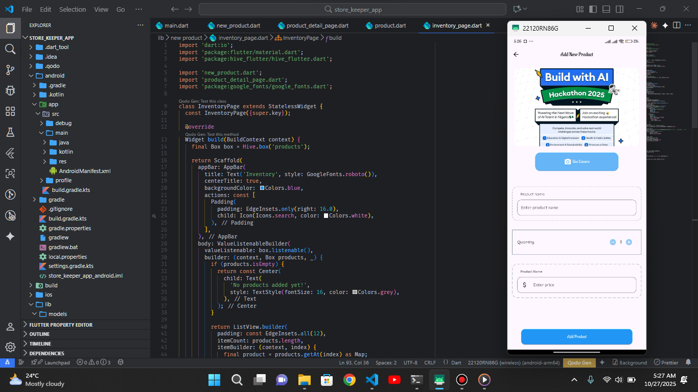

# store_keeper_app

A new Flutter project.

## Getting Started

This project is a starting point for a Flutter application.

# Inventory App

#  StockKeeper App

StockKeeper is a simple inventory management app that lets organizations efficiently manage their stock. Users can add products with images (captured via the camera or selected from storage), along with name, quantity, and price details. All records appear on the inventory page, where items can be easily edited, updated, or deleted when needed.

[The inventory apk!](https://appetize.io/app/b_erbb7gdpk4v3yqtf7jnouxoui4)

